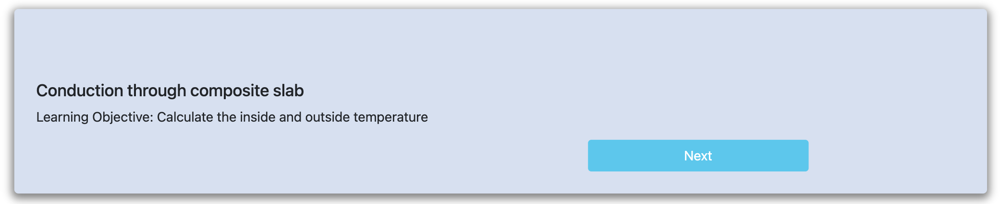
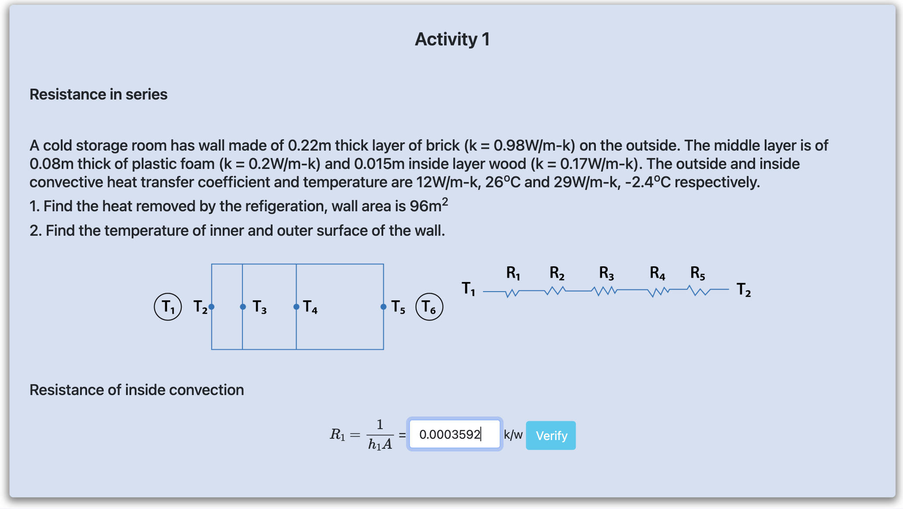
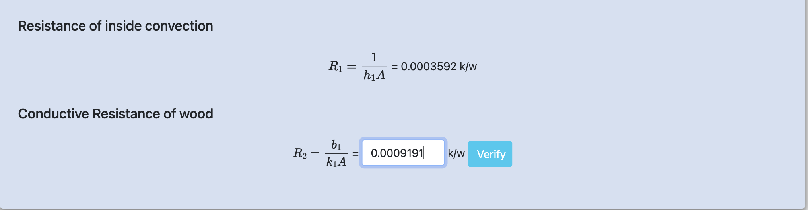
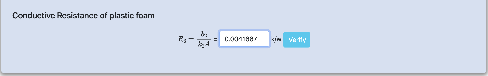
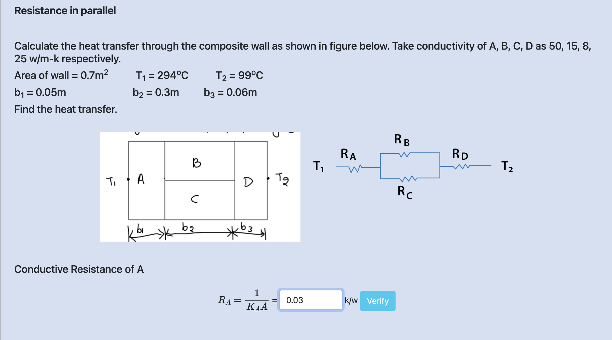
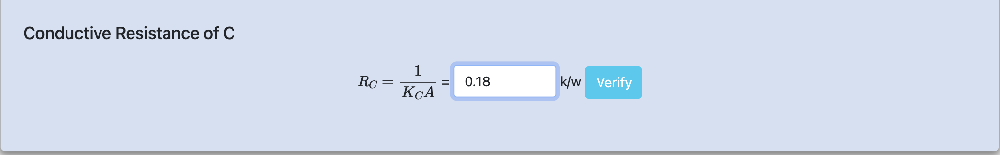
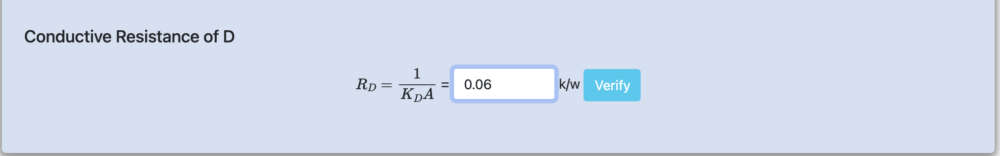
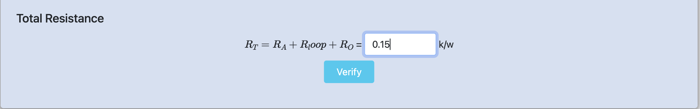
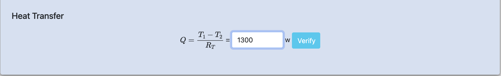

<h3>Step: 1</h3>

<h3>Step: 2</h3>

<h3>Step: 3</h3>

<h3>Step: 4</h3>

<h3>Step: 5</h3>

<h3>Step: 6</h3>

<h3>Step: 7</h3>

<h3>Step: 8</h3>

<h3>Step: 9</h3>

<h3>Step: 10</h3>

<h3>Step: 11</h3>

<h3>Step: 12</h3>

<h3>Step: 13</h3>

<h3>Step: 14</h3>

<h3>Step: 15</h3>

<h3>Step: 16</h3>

<h3>Step: 17</h3>
